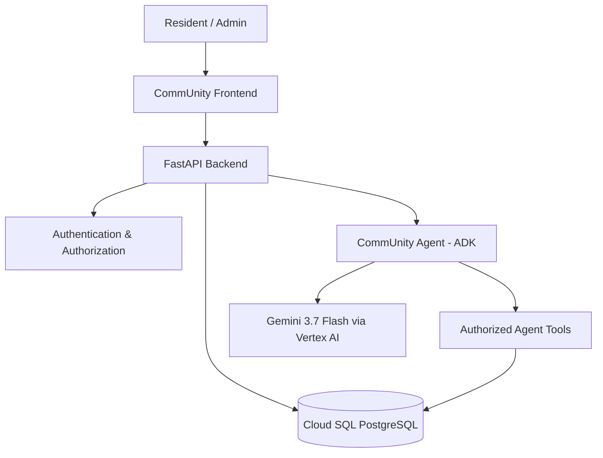
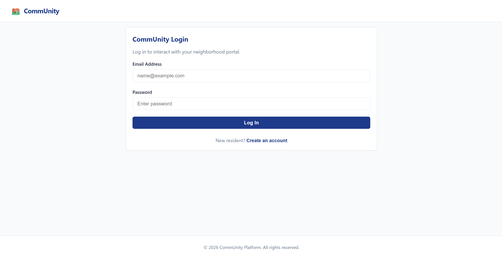
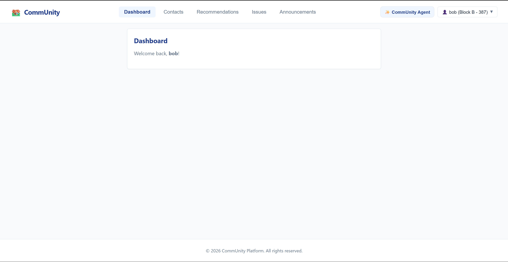
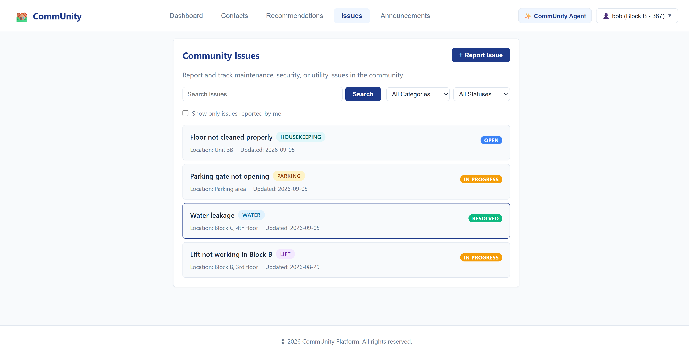
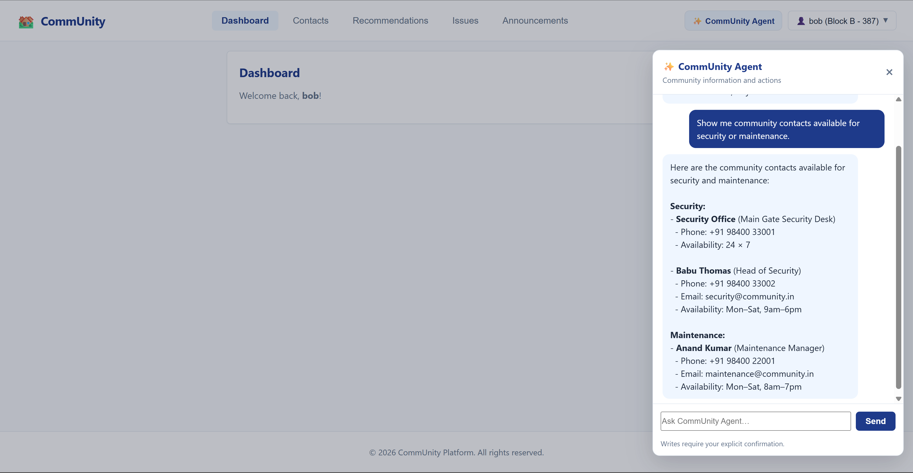
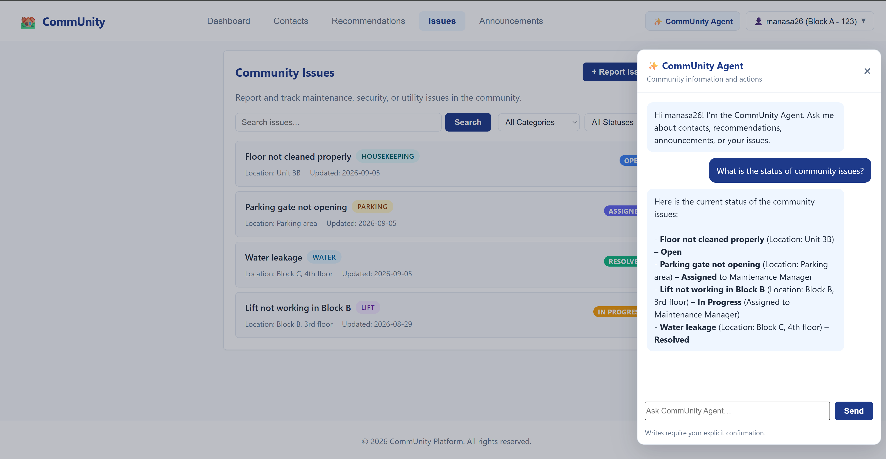
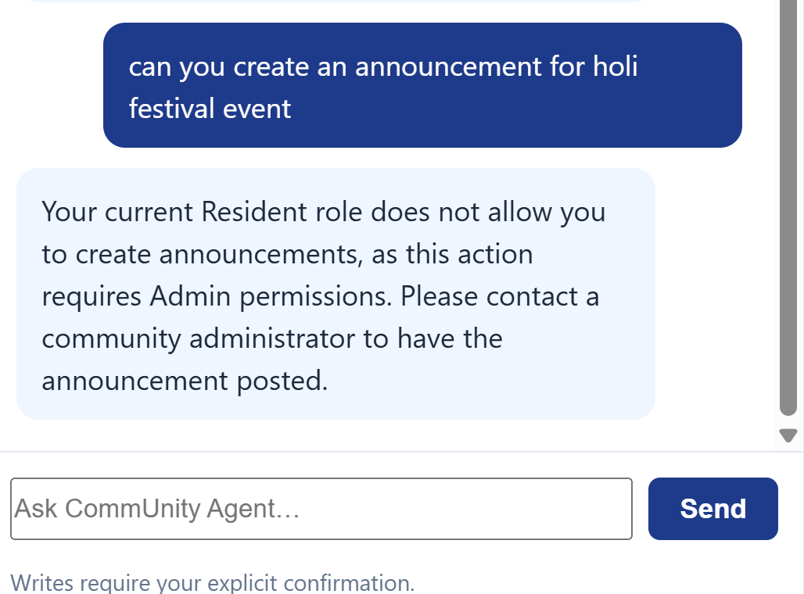

# CommUnity

**AI-Powered Community Intelligence Platform**

CommUnity is a residential community portal that helps residents access community information, share service recommendations, report and track issues, and read community announcements. Administrators can manage community information and issue workflows through the same application. The platform also includes a role-aware **CommUnity Agent** for natural-language community queries and authorized actions.

## Problem Statement

Residential communities often have community contacts, service recommendations, issue reports, and announcements spread across different channels. This can make information difficult to find, issues harder to track, and communication less efficient.

**CommUnity** brings these functions together in one portal and adds a role-aware AI Agent for natural-language information retrieval and authorized actions.

## Business Benefits

- Faster access to community information
- Better visibility and tracking of community issues
- Reduced administrative effort
- Improved resident communication and engagement
- AI-assisted self-service for common community tasks

## Key Features

### Resident

- Secure signup and login
- Personal dashboard and profile
- Browse and search community contacts
- Browse, search, create, edit, delete, and vote on service recommendations according to ownership/role rules
- Report and track community issues
- View community announcements
- Use the CommUnity Agent for community information and resident-authorized actions
- Resident issue visibility follows application privacy rules; reporter identity is not exposed to other residents

### Admin

- Admin-only access is controlled by the backend using the authenticated user's role
- Manage community contacts
- Manage recommendations
- Manage announcements, including publishing and archiving
- Manage issue status, assignment, and admin notes
- View/manage resident information available to the Admin tools
- Use the same CommUnity Agent for authorized administrative operations

## Resident vs Admin Feature Matrix

| Feature | Resident | Admin |
|---|:---:|:---:|
| View Contacts | Yes | Yes |
| View Recommendations | Yes | Yes |
| Create Recommendations | Yes | Yes |
| Manage Contacts | No | Yes |
| View Issues | Yes | Yes |
| Update Issue Status / Assignment / Notes | No | Yes |
| View Announcements | Yes | Yes |
| Manage Announcements | No | Yes |
| CommUnity Agent | Yes | Yes |

### Issue Lifecycle

Issues follow the workflow:

`Open → Assigned → In Progress → Resolved → Closed`

Historical issues are retained.

### Announcement Lifecycle

Announcements can be published or archived. Archived announcements are retained and hidden from the active resident view.

---

## Technology Stack

### Frontend

- HTML/CSS/JavaScript
- React 18 loaded in the browser
- Babel Standalone for JSX parsing in the browser

### Backend

- Python 3.13
- FastAPI
- Uvicorn
- Pydantic
- JWT authentication
- bcrypt password hashing

## Database

- PostgreSQL on Google Cloud SQL
- `pg8000` PostgreSQL driver
- Cloud SQL Python Connector

### AI / Agent

- Google Agent Development Kit (ADK)
- Google Gen AI SDK
- Gemini 3.7 Flash through Vertex AI
- One CommUnity Agent serves both Residents and Admins
- Tool access is controlled by authenticated user role and ownership rules
- Write operations require preview and explicit confirmation before execution

### Deployment

- Google Cloud Run
- Google Cloud Build
- Artifact Registry
- Google Cloud Secret Manager
- Cloud SQL
- Vertex AI

---

## Architecture

The FastAPI backend is the application's security boundary. The Agent receives the authenticated user's identity and role in its tool context, and tools enforce the appropriate permissions before performing protected operations.




---

## Project Structure

```text
CommUnity/
├── backend/
│   ├── main.py
│   ├── agent.py
│   ├── agent_routes.py
│   ├── auth_utils.py
│   ├── database.py
│   ├── create_admin.py
│   ├── requirements.txt
│   └── .env.example
│
├── frontend/
│   ├── index.html
│   ├── app.js
│   └── styles.css
│
├── screenshots/
└── Dockerfile
```

---

<details>
<summary><strong>Getting Started Locally</strong></summary>

## Getting Started Locally

### 1. Clone the repository

```bash
git clone <repository-url>
cd CommUnity
```

### 2. Create and activate a virtual environment

**Windows / Git Bash:**

```bash
cd backend
python -m venv venv
source venv/Scripts/activate
```

### 3. Install dependencies

```bash
pip install -r requirements.txt
```

### 4. Configure environment variables

Create:

```text
backend/.env
```

Copy the required configuration from `backend/.env.example` and provide the values for the target environment. Do not commit this file.

For local Google Cloud authentication, use Application Default Credentials as required by the Google Cloud client libraries.

### 5. Run the backend

From `backend/`:

```bash
uvicorn main:app --reload --port 8000
```

The FastAPI application serves the frontend from the sibling `frontend/` directory.

Open the local application at the address shown by Uvicorn (commonly `http://127.0.0.1:8000`).

---

</details>

<details>
<summary><strong>Authentication and Roles</strong></summary>

## Authentication and Roles

### Resident signup

Resident accounts can be created through the normal Signup flow. Signup creates users with the `Resident` role.

### Admin creation

Admin creation is intentionally not exposed through normal public signup. Admin accounts are created using the backend `create_admin.py` setup script or an existing administrative process.

### Security model

- Passwords are stored as bcrypt hashes.
- Login issues a JWT access token.
- Protected backend routes validate the token and load the current user from the database.
- Administrative actions require backend authorization; UI restrictions alone are not relied upon.
- Agent tools also enforce authenticated role/ownership checks.
- Agent write actions require explicit confirmation.
- Provider or secret details are not returned to the browser when the Agent encounters backend errors.

---

</details>

## Database

The production application uses PostgreSQL on Google Cloud SQL.

The application connects through the **Cloud SQL Python Connector** using `pg8000`; the connection does not require hard-coding a public database host/port in application code.

The database stores:

- Users
- Contacts
- Recommendations
- Recommendation votes
- Issues
- Announcements

The deployed application and local application can use the same Cloud SQL database when configured with the appropriate credentials and environment variables.

---

<details>
<summary><strong>CommUnity Agent</strong></summary>

## CommUnity Agent

The application uses one Agent for both Residents and Admins.

### Key AI Features

- Natural-language community queries
- Gemini-powered responses through Vertex AI
- Google Agent Development Kit (ADK) orchestration
- Tool-enabled database operations
- Role-aware and ownership-aware authorization
- Preview and explicit confirmation before write operations


### Read capabilities

- Search contacts
- Search recommendations
- Search announcements
- Search issues / retrieve the current user's issues according to role rules

### Resident write capabilities

- Create an issue
- Create a recommendation

### Admin write capabilities

- Create and update contacts
- Update recommendations
- Create and update announcements
- Update issue status, assignment, and admin notes

### Confirmation model

Protected writes use a preview/confirmation workflow:

```text
User request
    ↓
Agent prepares preview
    ↓
User explicitly confirms
    ↓
Agent executes the same action
```

The Agent must not claim that a write succeeded unless the backend tool reports success.

Agent session state is ephemeral; application data is persisted in Cloud SQL rather than in the Agent session.

---

</details>

<details>
<summary><strong>Cloud Run Deployment</strong></summary>

## Cloud Run Deployment

The project is deployed as a container to Google Cloud Run.

### Container build

The repository includes a root `Dockerfile` so the Cloud Run container contains both:

- `backend/` — FastAPI application
- `frontend/` — browser UI

The container starts Uvicorn on port `8080`, matching the Cloud Run container port configuration.

### Source deployment

From the repository root, a source deployment can be performed with:

```bash
gcloud run deploy community \
  --source . \
  --region us-central1 \
  --service-account <Cloud Run runtime service account> \
  --min 0 \
  --max 1
```

Production environment variables and secrets are supplied through Cloud Run configuration and Secret Manager. The repository does **not** contain production secret values.

### Runtime services

The Cloud Run runtime service account is configured with the Google Cloud permissions required by the application, including access to:

- Cloud SQL
- Vertex AI
- Secret Manager

Cloud Run is configured with `min=0` so idle application instances can scale down.

---

</details>

<details>
<summary><strong>Required Environment Variables</strong></summary>

## Required Environment Variables

The following names are used by the application configuration:

| Variable | Purpose |
|---|---|
| `INSTANCE_CONNECTION_NAME` | Cloud SQL instance connection name |
| `DB_NAME` | PostgreSQL database name |
| `DB_USER` | PostgreSQL database user |
| `DB_PASSWORD` | PostgreSQL password; store securely |
| `JWT_SECRET` | Secret used to sign/verify JWTs; store securely |
| `JWT_ALGORITHM` | JWT signing algorithm (currently `HS256`) |
| `ACCESS_TOKEN_EXPIRE_MINUTES` | JWT expiry duration |
| `GOOGLE_GENAI_USE_VERTEXAI` | Enables Vertex AI for Gemini |
| `GOOGLE_CLOUD_PROJECT` | Google Cloud project used for Vertex AI |
| `GOOGLE_CLOUD_LOCATION` | Vertex AI serving location |

**Never commit `backend/.env` or secret values to GitHub.**

---

</details>

## Screenshots

The repository includes a `screenshots/` folder with the project screenshots.


### Login


### Resident Dashboard


### Issues


### Resident Agent


### Admin Agent


### Permission Denied



<details>
<summary><strong>Troubleshooting</strong></summary>

## Troubleshooting

### Unable to log in

Verify that the backend is using the correct database and that `JWT_SECRET` is configured consistently for the running environment.

### Agent is unavailable or returns a backend error

Check Vertex AI configuration, the Cloud Run runtime service account, and the required Google Cloud environment variables. Do not place API keys or other secrets in source code.

### Deployed application cannot access data

Check that the Cloud SQL instance is running and that the Cloud Run runtime service account has the required Cloud SQL permissions.

### Cloud Run revision fails to start

Check the Cloud Run revision logs and verify that required environment variables and Secret Manager references are configured.

</details>

<details>
<summary><strong>Repository and Secret Hygiene</strong></summary>

## Repository and Secret Hygiene

Before pushing to GitHub, verify that the following are excluded from the repository:

```text
backend/.env
backend/venv/
backend/.adk/
backend/community.db
*.pyc
```

Also keep out of GitHub:

- Database passwords
- JWT secrets
- API keys
- Service-account private keys
- Personal credentials
- Evaluation passwords

---

</details>